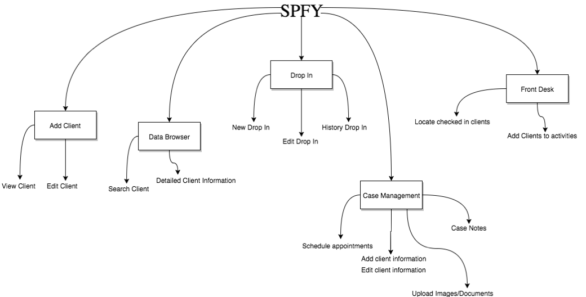
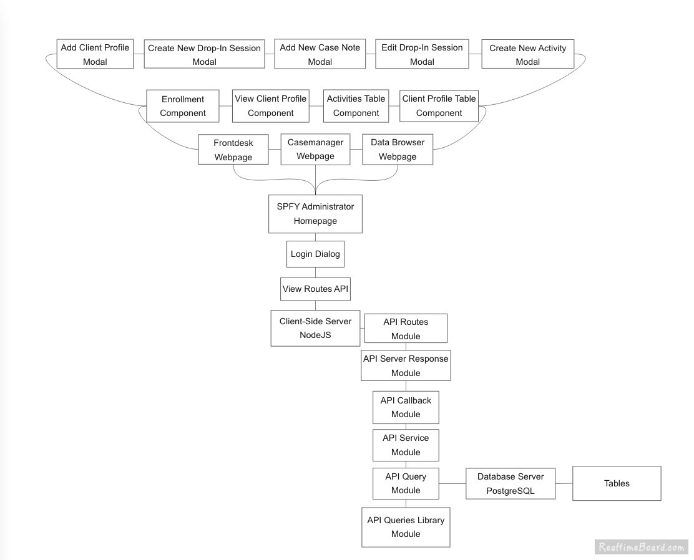

**6.0 Architectural Design Document**

**6.1 Introduction**

This document presents the architecture for the software for the Safe
Place for Youth (SPY) database as described in the [*Requirements
Specification*](https://github.com/SirSeim/SPFY/blob/master/docs/Requirements_Specification.md).
The SPY Database will allow users to store and retrieve data over the
Internet from any platform, be it a desktop computer, tablet, or
smartphone.

**6.1.1 System Objectives**

This system will be uniquely customized to suit the needs of Safe Place
for Youth, a nonprofit organization that serves homeless youth, and will
allow SPY staff to securely store and retrieve client information for
each youth enrolled in their programs. Thus, at the heart of this system
lives the youth profile, which contains a youth’s important health,
legal, and participation information. Additionally, the SPY staff will
have user profiles, and each of SPY’s programs will have a “program
profile.”

The SPY Database system architecture is comprised of a client-side,
browser-based interface (frontend), a cloud-hosted server (backend), and
the database itself that will store, send, and query data. The frontend
will consist of various web-pages that will allow users to easily input,
request, and query information stored in the database. The server
backend and database will be configured to optimize concurrent access as
well as comply with HIPAA security rules to protect confidential client
information.

**6.1.2 Hardware, Software, and Human Interfaces**

  **Interface Type**       | **Interface Description**
  ------------------------ |---------------------------
  Human Interface          | Mouse & Keyboard
  Human Interface          | Monitor
  Software Interface       | Threaded database
  Software Interface       | Non threaded server
  Software Interface       | Socket Interface
  Hardware Interface       | Wireless networking

**6.2 CSCI Descriptions**

* Front Page CSC
  * Navbar
  * Initial Page
  * Front Desk Home Page
    * Activities Table
    * Client Profile Table
    * Check-in Table
    * Add Dropin
    * View Dropin History
    * Add Client
  * Clients Home Page
    * Add Client
    * Client Profile Table
    * View Client
    * Edit Client
    * Add Documents
  * Add Client
  * Data Browser
    * Select Resource
    * Query Resource
    * Results Table
    * Details Pane
    * Settings Page
      * Change Password
      * Notifications Settings
      * Statuses Settings
      * Flags Settings
      * Create New Activity
      * Import Data
* Server CSC -- Passes data between frontend and database
  * API
    * Queries
      * Create / Get / Edit / Delete Case Manager(s)
      * Create / Get / Edit / Delete Client(s)
      * Create / Get / Edit / Delete Drop In(s)
      * Create / Get / Edit / Delete Program(s)
      * Create / Get / Edit / Delete Subprogram(s)
      * Create / Get / Edit / Delete Activities
      * Create / Get / Edit / Delete Appointment(s)
      * Create / Get / Edit / Delete Drop In & Activity Match
      * Create / Get / User Activity
      * Custom queries based on user input
  * Routes
    * API Routes
    * View Routes
* Database CSC -- Data is stored and accessed via queries
  * Tables
    * Case Manager
    * Client
    * Documents
    * Prescreen
    * Background
    * Housing History
    * Natural Connection
    * Pregnant and Parenting
    * Substance Abuse
    * Mental Health
    * Referral
    * Additional Info
    * Forms
    * Program
    * Subprogram
    * Activity
    * Drop In
    * Match Drop In Activity
    * Match Drop In Client
    * Monthly Statistics
    * Appointment
    * Activity Log

**6.2.1 Concept of Execution**

> Spfy application has a lot of linked use cases. There are five
> important use cases within this application. The five are Add Client,
> Data Browser, Drop In, Case Management and Front Desk. The main use
> case would be Add Client, the user of this application would be able
> to add clients information when first meeting them. This information
> would then be stored in the database. The Data Browser is an interface
> for the database so that the user would be able to search client and
> retrieve detailed client information. Everything works around the Case
> Management system, in this system the user would be able to schedule
> appointments for the client, add/client information, add case notes
> and upload image files and documents. SPFY has different programs and
> activities on certain days, Drop In enables the users to add drop in,
> edit drop in and view the history of the drop in. Lastly, Front Desk
> is a homepage where the user, after adding the new clients information
> to the system would then be able to locate checked in clients for the
> day and add clients to activities and programs.

**6.2.2 Interface Design**

The following section provides details of the different interfaces
between segments of the SPY Database. The figures below give a detailed
outline of the modules and functions that comprise the interfaces of
each segment.

**6.2.2.1 Interface Identification and Diagrams**

**6.2.2.2 Project Interactions**

> The three primary aspects of the project are the frontend, the server,
> and the database. When navigating to a certain portion of the web app,
> the server returns the appropriate html page to render. When
> necessary, the front end utilizes ajax calls to pass JSON data to the
> server, which retrieves the payload data and utilizes it for API
> calls. During API calls, the server initializes a connection to the
> database and executes a query string along the established connection.
> The database retrieves the queried data and passes it back to the
> server, which converts it to JSON. From there, the server passes the
> necessary JSON data, along with a response code, back to the front end
> to be displayed in the page. For example, when the user navigates to
> the add client page, the server sends a response and provides the add
> client page. When the user hits the page’s submit button, an ajax call
> containing the input data is passed to the server. From there, the
> server executes the addClient function, which uses the established
> database connection to execute an INSERT query containing the user
> input data. The database returns a success response, which the server
> passes back to the frontend to relay to the user.

**6.3 Preliminary User Manual**

**Initialize Webpage**

Navigate to [*http://spfy-test.herokuapp.com/*](http://spfy-test.herokuapp.com/). 
By scrolling down, text prompts, “What would you
like to do?” From here, there are four options that will navigate to
different locations and that satisfy different use cases. The five
include:

1.  Front Desk - Navigates to the front desk home page, useful for the
    front desk manager. Easy access to search check-in, search client
    profiles, add new client, and current drop-in activity menu. More
    information on these individual tasks is explained below.

2.  Clients - Navigates to the case management page, designed for
    case managers. Provides access to focused alerts, daily activities,
    status tasks, and client search.

3.  Case Notes - Navigates to create new case note, helpful to Case
    Managers

5.  Add a Client - *Should* navigate to front desk homepage, and
    initiate the pop-up

**Getting to the Front Desk:**

Click on “Front Desk” as listed on the navbar

**Front Desk Info:**

-   Directly underneath the “Front Desk” title, are KPIs, namely Total
    Youth Checked-in and New Youth

-   Directly underneath is the list of checked in youth, including notes
    with color coded tags

    -   This list is searchable with the search bar at the top of the
        module

    -   Upon clicking an entry in the list, a modal or tooltip for
        displaying more info about a client, including specifics on the
        tags and notes mentioned in the list.

-   Below that is a collection of modules that will allow for client
    searching, enrolling, checking-in, activity searching, and more.

-   Another tab in this area will present the user with the means for
    searching and extracting details from past drop-in sessions.

**Getting to Case Management:**

Click on “Clients” as listed on the navbar

**Adding a Client:**

Click the button labeled “Add Client” that will redirect to the Add client 
page. Additionally, select "Add Client" on the Front Desk Homepage.

**Querying the Database**

Select "Data Browser" in the Navbar. Choose a table and column to query.

**Alter settings**

Select the Profile dropdown on the Navbar, then select settings
