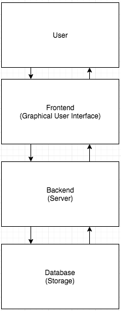

## 5.0	Requirements Specification

## 5.1	Introduction
This Software Requirements Specification (SRS) documents the requirements for the Safe Place for Youth (SPY) Database Website Application (called “SPY Database” or “SPY Database Web App” or “SPY Database App” for the purposes of this document).
The SPY Database is a cloud-based web application that will allow users to store and retrieve data over the Internet from any platform, be it a desktop computer, tablet, or smartphone. This system will be uniquely customized to suit the needs of Safe Place for Youth, a nonprofit organization that serves homeless youth, and will allow SPY staff to securely store and retrieve client information for each youth enrolled in their programs. Thus, at the heart of this system lives the youth profile, which contains a youth’s important health, legal, and participation information. Additionally, the SPY staff will have user profiles, and each of SPY’s programs will have a “program profile.”
The SPY Database system architecture is comprised of a client-side, browser-based interface (frontend), a cloud-hosted server (backend), and the database itself that will store, send, and query data. The frontend will consist of various web-pages that will allow users to easily input, request, and query information stored in the database. The server backend and database will be configured to optimize concurrent access as well as comply with HIPAA security rules to protect confidential client information.

	

## Outline of Requirements Specifications
- 5.2	CSCI Component Breakdown
- 5.3	Functional Requirements by CSC
- 5.4	Performance Requirements by CSC
- 5.5	Project Environment Requirements
	- 5.5.1	Development Environment Requirements
	- 5.5.2	Execution Environment Requirements

	
### 5.2 	CSCI Component Breakdown
- 5.2.1		SPY Staff Frontend CSC -- GUI components that the user will interact with
	- 5.2.1.1		Login Page CSU -- modules for accessing the system
		- 5.2.1.1.1	Login input module -- input fields for user credentials
		- 5.2.1.1.2	Login button module -- buttons to submit inputs to server
		- 5.2.1.1.3	Add New User Account module -- 
			- 5.2.1.1.3.1	Input fields for username, password, and occupation
			- 5.2.1.1.3.2	Submission 
		- 5.2.1.1.4	Delete User Account module -- 
	- 5.2.1.2		Front-Desk Page CSU -- page that hosts tools for SPY front desk tasks
	- 5.2.1.3		Case Manager Page CSU -- page that hosts case management tools
	- 5.2.1.4		Case Notes CSU -- modules for creating and searching case notes
		- 5.2.1.4.1	Case note text module -- text area input for writing and formatting case notes
		- 5.2.1.4.2	Add case note button module -- button for submitting new note
	- 5.2.1.5		Search CSU -- modules for searching stored data
		- 5.2.1.5.1	Search bar module -- input fields for user searches
	- 5.2.1.6		Settings CSU -- modules for configuring user settings for the web app
		- 5.2.1.6.1	Notifications CSU -- modules for handling notifications from the web app
	- 5.2.1.7		Troubleshoot CSU -- modules for troubleshooting the system

- 5.2.2		Server CSC -- server components that will host the Frontend
	- 5.2.2.1		NodeJS CSU -- modules for serving up Frontend files
	- 5.2.2.2		HTTPS CSU -- modules for network requests
	- 5.2.2.3		API Routes CSU

- 5.2.3		Database CSC -- database components that will store the data
	- 5.2.3.1		Queries CSU -- modules that will run queries on stored data
	- 5.2.3.2		Indexing CSU -- modules that will index the data
	- 5.2.3.3		Tracking CSU -- modules that will track user activity

### 5.3	Functional Requirements

The SPY Database Web App will allow SPY staff to input client information that will be stored in the system’s cloud database. In the requirements that follow, “user” is understood to be SPY staff (case managers, directors, and administrators). SPY staff will have the ability retrieve and query this same information on demand as well as generate reports on stored data. The system will also have the ability to easily import pre-formatted data.

- 5.3.1	Frontend
	- 5.3.1.1		The Frontend shall display an initial login page for SPY staff.
	- 5.3.1.2		The Frontend shall provide instructions for how to use the login page.
	- 5.3.1.3		The Frontend shall provide text entry fields into which the user may type values.
	- 5.3.1.4		The Frontend shall provide error checking on the text entry fields such that the user is provided immediate feedback in case of erroneous entry.
	- 5.3.1.5		The Frontend shall direct users with different levels of access to different main pages.
	- 5.3.1.6		The Frontend shall include a navigation bar at the top of the page.
	- 5.3.1.7		The Frontend shall have menus for navigating between pages and content.
	- 5.3.1.8		The Frontend shall have search bars for searching through large tables of information.
	- 5.3.1.9		The Frontend shall have tables displaying information in rows and columns.
	- 5.3.1.10	The Frontend shall react to mouse clicks on displayed buttons.
	- 5.3.1.11	The Frontend shall display real-time data.
	- 5.3.1.12	The Frontend shall display status indicators for youth profiles.
	- 5.3.1.13	The Frontend shall provide a means to represent the same data in numerous visual ways
	- 5.3.1.14	The Frontend shall provide a means for displaying appointments.
	- 5.3.1.15	The Frontend shall require users to manually input personal information via text fields.
	- 5.3.1.16	The Frontend shall have a case manager page.
		- 5.3.1.16.1	The case manager page will have a panel listing youth profiles.
		- 5.3.1.16.2	The case manager page shall have a to-do list panel.
		- 5.3.1.16.3	The case manager page shall have a button for adding a new client.
	- 5.3.1.17	Each youth profile listed on the panel shall be color coded based on youth status.
	- 5.3.1.18 	The Frontend shall have a front desk page.
		- 5.3.1.18.1	The front desk page shall have a panel with a list of youth who need to finish intake.
		- 5.3.1.18.2	The front desk page shall have a button to create a new drop-in session.
		- 5.3.1.18.3	The front desk page shall have a button to edit a drop-in session.
		- 5.3.1.18.4	The front desk page shall have a button to view a drop-in session.
		- 5.3.1.18.5	The front desk page shall have a button for drop-in enrollment.
	- 5.3.1.19	The Frontend shall have a New Drop-In Session page.
		- 5.3.1.19.1	The drop-in page shall have fields to input details for the drop-in session.
	- 5.3.1.20	The Frontend shall have a Drop-In Enrollment tracking page.
		- 5.3.1.20.1	The enrollment tracking page shall have panel listing all of the SPY activities for the day.
		- 5.3.1.20.2	The enrollment tracking page shall have display for tracking total youth attendance.
		- 5.3.1.20.3	The enrollment tracking page shall provide a means to check-in youth to drop-in
	- 5.3.1.21	The Frontend shall have an Outreach page.
		- 5.3.1.21.1	The outreach page shall have a button to create a new outreach session.
		- 5.3.1.21.2	The outreach page shall have a button to add a new client.
		- 5.3.1.21.3	The outreach page shall have a button to add a new outreach location.
		- 5.3.1.21.4	The outreach page shall have a button to add a new outreach partner.
		- 5.3.1.21.5	The outreach page shall have a button to add a new outreach volunteer.
	- 5.3.1.22	The Frontend shall have a New Outreach Session page.
		- 5.3.1.22.1	The new outreach session page shall have fields to input details for the new outreach session.
		- 5.3.1.22.2	The new outreach session page shall have a button to add a new youth to the session.
		

- 5.3.2	Backend
	- 5.3.2.1		The Backend shall respond to HTTP requests from the client.
	- 5.3.2.2		The Backend shall forward the results of queries from the Database to the Frontend.
	- 5.3.2.3		The Backend shall support concurrent access of the database from multiple users.
	- 5.3.2.4		The Backend shall timeout the network connection to the database after prolonged idling of 3 minutes at the least.
	- 5.3.2.5		The Backend shall send error messages with details about connection issues.
	- 5.3.2.6		The Backend shall close network channels that are not in use.
	- 5.3.2.7		The Backend shall determine a network channel to not be in use when that channel has not made a request in the previous 3 minutes or longer.
	- 5.3.2.8		The Backend shall maintain a network log.
	- 5.3.2.9 		The Backend network log shall track successful HTTP requests.
	- 5.3.2.10		The Backend network log shall track failed HTTP requests.
	- 5.3.2.11		The Backend network log shall track server load.
	- 5.3.2.12		The Backend network log shall track request speed.
	- 5.3.2.13		The Backend network log shall track requests per second.
	- 5.3.2.9		The Backend shall send periodic reports on network performance every second at the least.
	- 5.3.2.10	The Backend shall respond with a 404 error code when a page or route is not found.
	- 5.3.2.11	The Backend shall respond with a 500 error code when there is an error in the client-side server.
	- 5.3.2.12	The Backend shall respond with a 200 error code when an HTTP request is successfully made and returned.

- 5.3.3	Database
	- 5.3.3.1		The Database shall perform queries on stored data.
	- 5.3.3.2		The Database shall prevent errors from concurrent data modification.
	- 5.3.3.3		The Database shall perform basic statistical analysis on queried data.
	- 5.3.3.4		The Database shall generate aggregate data that can be used for reports.
	- 5.3.3.5		The Database shall have procedures for backing-up stored data.
	- 5.3.3.6		The Database shall be accessible only through an API
	- 5.3.3.7		The Database shall be HIPAA compliant
	- 5.3.3.8		The Database shall be hosted by a HIPAA compliant cloud service
	- 5.3.3.9		The Database shall maintain activity tracking logs according to HIPAA compliance

- 5.3.4	System-wide
	- 5.3.4.1		The system shall provide a means for retrieving lost password information.
	- 5.3.4.2		The system shall provide a means for resetting user passwords.
	- 5.3.4.3		The system shall provide a means for troubleshooting connection errors.
	- 5.3.4.4		The system shall provide a means for monitoring vulnerabilities.
	- 5.3.4.4		The system shall provide a means for creating a new client profile.
	- 5.3.4.5		The system shall provide a means for creating a new user profile.
	- 5.3.4.6		The system shall provide a means for creating a new program profile.
	- 5.3.4.5		The system shall provide a means for editing existing client profile information.
	- 5.3.4.8		The system shall provide a means for editing existing user profile information.
	- 5.3.4.9		The system shall provide a means for editing existing program profile information.
	- 5.3.4.6		The system shall provide a means for deleting existing client profile information.
	- 5.3.4.11	The system shall provide a means for deleting existing user profile information.
	- 5.3.4.12	The system shall provide a means for deleting existing program profile information.
	- 5.3.4.13	The system shall incorporate different levels of user access for the database.
	- 5.3.4.14	The system shall have a means for communicating its current functional status to users.
	- 5.3.4.15	The system shall provide a means for scheduling appointments.
	- 5.3.4.16	The system shall provide a means for managing appointments.
	- 5.3.4.17	The system shall integrate with calendar software.
	- 5.3.4.18	The system shall integrate with email software.
	- 5.3.4.19	The system shall forward scheduled appointments to automatically populate the calendar software.
	- 5.3.4.20	The system shall use flags to indicate the status of user, client, and program profile information.
	- 5.3.4.21	The system shall provide a means for sending and receiving notifications to various software applications.
	- 5.3.4.22	The system shall provide a means for importing data.
	- 5.3.4.23	The system shall provide a means for exporting data.
	- 5.3.4.24	The system shall provide a means for users to customize settings for the entire system (Frontend, Backend, Database).
	- 5.3.4.25	The system shall allow case manager profiles to access data from other case manager profiles.
	- 5.3.4.26	The system shall provide a means for storing document files.
	- 5.3.4.27	The system shall provide a means for storing image files.
	- 5.3.4.28	The system shall provide a means for tracking valuable items (backpacks, phones, keys, . . . etc.)

### 5.4	Performance Requirements

- 5.4.1	Successful login occurs within 5 seconds:
Upon entering credentials, the user should not have to wait more than 5 seconds to be redirected to their main profile page upon successful verification of those credentials.

- 5.4.2	Nearly instantaneous navigation:
Users should not experience delays in navigating between pages.

- 5.4.3	Usability design principles for the Frontend:
The graphical user interface shall be human-friendly and intuitive.

	- 5.4.3.1	Feedback:
At all times, the interface shall communicate the results of any interaction, making those results visible and understandable.

- 5.4.4	Accessibility:
Minimum standard software requirements for users with disabilities shall be met.

	- 5.4.4.1	Screen-reading:
Formats for screen-reading applications to utilize will be incorporated into the Frontend design.

	- 5.4.4.2	Voice navigation:
Formats for verbal mouse-grid navigation will be incorporated into the Frontend design.

- 5.4.5	Search results within 1 second:
Users should see the first results of a search within 1 second of initiating the search.

- 5.4.6	Optimize storage:
The Database subsystem should be able to store the maximum amount of data with the minimum amount of storage space.

- 5.4.7 Bandwidth:
The Backend should optimize use of available bandwidth for data transmission.

- 5.4.8	Network connection cutoff:
The system should have default procedures for handling incomplete transactions during a network crash.

- 5.4.9	Modular programming:
The system design should incorporate separating functionality into independent, interchangeable modules, such that each contains everything necessary to execute only one aspect of the system’s overall functionality.

- 5.4.10 Open-endedness:
The system design should incorporate design principles that allow for easily modifying the system architecture or building more into the system by future developers.

- 5.4.11 Data migration:
The data stored in the Database will be able to easily migrate to other database software in the future.

- 5.4.12 Emergency backup:
The Database should immediately backup data if network or server issues are detected.

### 5.5	Project Environment Requirements 

Utilizing pre-built frameworks such as Node.js will expedite development and provide more secure and stable server-side hosting.

#### 5.5.1	Development Environment Requirements

| Category | Requirement |
|---|---|
| Front End | Bootstrap, ComboDate, jQuery, Notify, Moment, Spectrum  | 
| Server | Node.js, npm, Hapi, Joi, npm-pg, Chai, CodeCov, ESLint, Istanbul, Mocha, Mocha-Istanbul, Nodemon |
| Database | PostgrSQL |

#### 5.5.2	Execution Environment Requirements

| Category | Requirement |
|---|---|
| Frontend | I/O server-side environment and API |
| Server | HIPAA compliant third-party cloud server hosting |
| Database | HIPAA compliant third-party cloud database hosting |

Due to the services that Safe Place for Youth provides and the population that they serve, all software for this system must follow HIPAA security protocols. Furthermore, the need to reduce the risk for data loss as well as the need for ubiquitous access to the SPY Database Web App from any platform requires a third-party cloud hosting service that specializes in secure data storage and maintenance.
